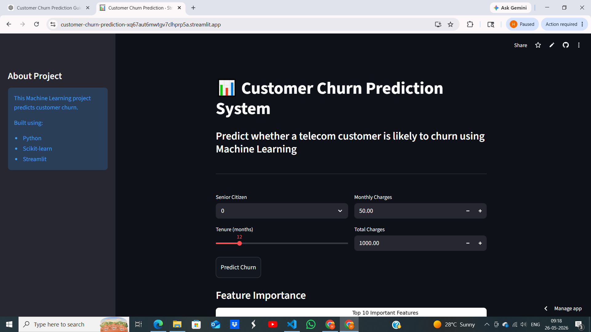
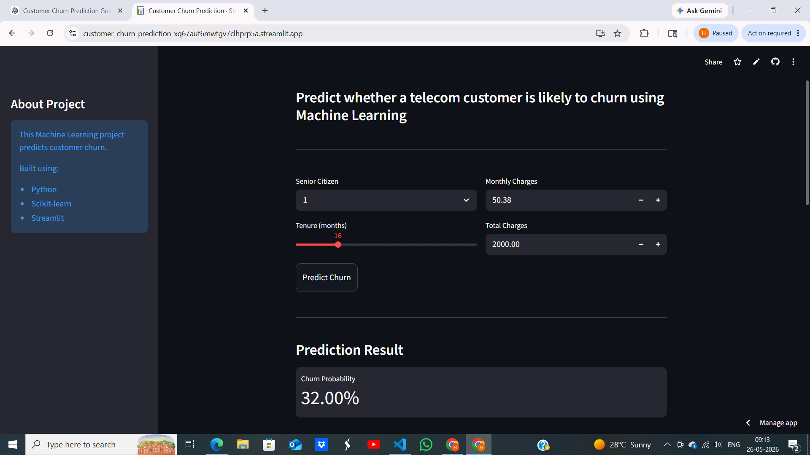

# 📊 Customer Churn Prediction Using Machine Learning

## 🚀 Live Demo
[Streamlit App](https://customer-churn-prediction-xq67aut6mwtgv7clhprp5a.streamlit.app/)

---

## 📌 Project Overview

This project predicts whether a telecom customer is likely to churn using Machine Learning.

The application is built using:
- Python
- Scikit-learn
- Streamlit

The model analyzes customer information and predicts churn probability in real time.

---

## ✨ Features

✅ Customer churn prediction  
✅ Probability score  
✅ Interactive Streamlit dashboard  
✅ Feature importance visualization  
✅ Real-time predictions  
✅ Machine learning model deployment  

---

## 🛠️ Tech Stack

- Python
- Pandas
- NumPy
- Scikit-learn
- Streamlit
- Matplotlib
- Joblib

---

## 🤖 Machine Learning Model

Model Used:
- Random Forest Classifier

---

## 📂 Project Structure

```text
customer-churn-prediction/
│
├── app.py
├── requirements.txt
├── runtime.txt
│
├── models/
│   ├── churn_model.pkl
│   └── model_columns.pkl
│
├── notebooks/
│   └── churn_prediction.ipynb
│
└── README.md






## 📈 Future Improvements

- Add AWS deployment
- Add CI/CD pipeline
- Add Docker support
- Add database integration
- Add real-time analytics dashboard
- Add advanced explainable AI features