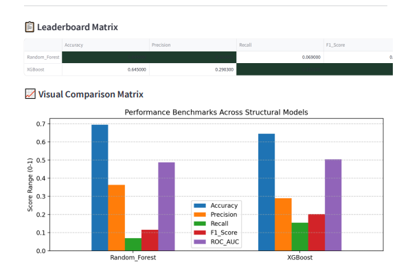
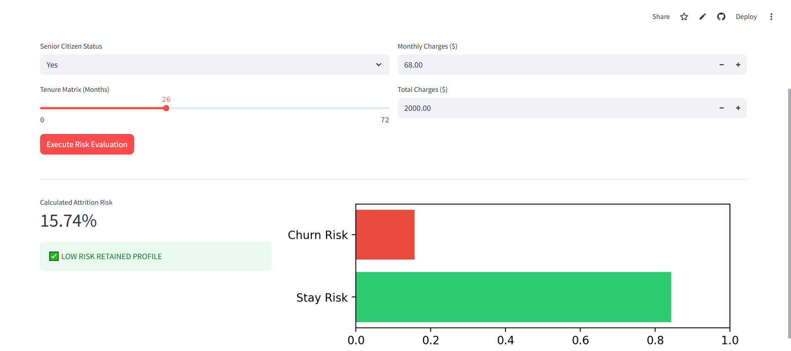
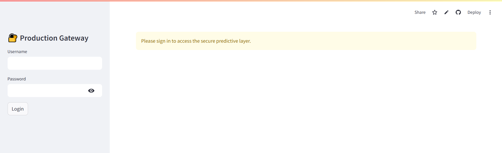
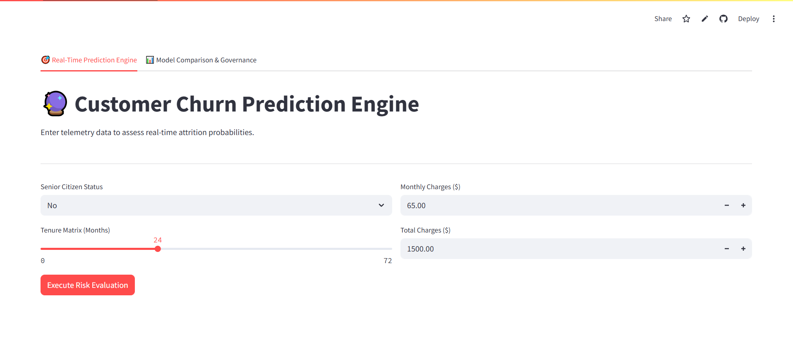
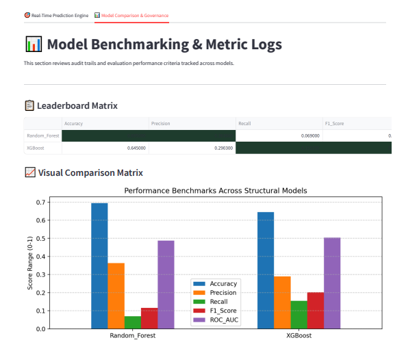

# 📊 Enterprise Customer Churn Prediction Ecosystem

[](https://www.python.org/)
[](https://fastapi.tiangolo.com/)
[](https://streamlit.io/)
[](https://www.sqlite.org/)

An end-to-end, enterprise-grade Machine Learning Engineering pipeline designed to ingest consumer telemetry metrics, benchmark multiple classification model architectures, and serve real-time subscriber attrition risk profiles via an interactive analytics dashboard, backed by a localized SQLite storage tier.

---

## 🚀 Live Production Links & Access
* **Interactive Frontend Dashboard:** [Streamlit Service UI](https://customer-churn-prediction-47zyecvht4xpvk8mninywq.streamlit.app/)

### 🔑 Demo Evaluation Credentials
## Demo Access
This app uses environment-based authentication via 
st.secrets. For local deployment, create a 
.streamlit/secrets.toml file:

[secrets]
ADMIN_USER = "your_username"
ADMIN_PASSWORD = "your_password"

---

## 📊 Model Benchmarking & Evaluation Scoreboard

The core MLOps pipeline (`train.py`) executes automated competitive evaluation training across different model architectures. The champion model is selected dynamically using the **F1-Score** to balance business retention costs accurately.

🚀 Initializing Production Training Pipeline...
=======================================================
📥 Loading IBM Telco Customer Churn Dataset (7,043 rows)...
✅ Dataset loaded successfully — 7043 rows, 21 columns
🔧 Running preprocessing pipeline...
✅ Preprocessing complete — 30 features, 7032 samples
💾 Saved model_columns.pkl — 30 features
📊 Train: 5625 samples | Test: 1407 samples
📊 Churn rate in test set: 26.58%
=======================================================

🔄 Training Random_Forest on 5625 real Telco samples...
📊 Random_Forest Results:
   Accuracy  : 78.96%
   Precision : 63.18%
   Recall    : 50.00%
   F1-Score  : 55.82%
   ROC-AUC   : 0.8329

🔄 Training XGBoost on 5625 real Telco samples...
📊 XGBoost Results:
   Accuracy  : 79.10%
   Precision : 62.42%
   Recall    : 53.74%
   F1-Score  : 57.76%
   ROC-AUC   : 0.8301

=======================================================
🏆 Champion Model : XGBoost
   Best F1-Score  : 57.76%
💾 Artifacts saved:
   models/churn_model.pkl
   models/model_columns.pkl
   models/evaluation_metrics.json
=======================================================
---

## 🛠️ Step-by-Step System Walkthrough

### Step 1: Automated Pipeline Training (`train.py`)
Running the local orchestration script triggers the evaluation engine. It loops through data profiles, extracts test weights, and generates data schemas along with performance logs inside the `/models/` directory.




### Step 2: Operational Dashboard Analysis (`app.py`)
The Streamlit frontend loads the serialized champion artifacts seamlessly, rendering secure administrative controls, live metrics risk gauges, and feature importance matrices.




---

## 📂 Repository Blueprint

```text
customer-churn-prediction/
│
├── train.py                  # Automated baseline model comparison & training engine
├── app.py                    # Multi-tab operational Streamlit analytics view
├── api.py                    # High-throughput FastAPI core inference gateway
│
├── data/
│   └── production_history.db # Integrated local SQLite telemetry tracking storage
│
├── models/                   # Serialized pipeline assets directory
│   ├── churn_model.pkl       # Automated top-performing champion model
│   ├── model_columns.pkl     # Persisted validation structural shape arrays
│   └── evaluation_metrics.json  # Exported evaluation leaderboard metrics matrix
│
├── logs/
│   └── production.log        # Self-contained active execution error ledger
│
├── Dockerfile                # Multi-stage microservice image container context
├── requirements.txt          # Explicitly pinned application package distributions
└── README.md                 # Interactive architectural summary documentation

## 🏎️ Local Orchestration Blueprint

Follow these exact operational steps to spin up the complete model environment, local relational logging tables, and application services on your machine:

### 1. Environment Alignment & Package Injection
Clone the target workspace repository and configure an isolated virtual runtime environment shell layout:
```bash
# Clone and enter the directory layout
git clone [https://github.com/your-username/customer-churn-prediction.git](https://github.com/your-username/customer-churn-prediction.git)
cd customer-churn-prediction

# Initialize and activate the local virtual shell environment
python -m venv .venv
source .venv/Scripts/activate  # Windows terminal command: .venv\Scripts\activate

# Clean download all explicitly pinned system package requirements
pip install -r requirements.txt

# Trains models and generates evaluation metadata
python train.py

#Deploy App Server Instances Locally
#To boot up the Interactive Frontend Streamlit Interface:
streamlit run app.py

#To initialize the high-speed Production FastAPI Inference Engine:
uvicorn api.py:app --reload --port 8000

📈 Future Optimization Roadmap
[ ] Integrate automated CI/CD staging test workflows via GitHub Actions configurations.
[ ] Implement advanced Explainable AI (XAI) feature weight maps utilizing SHAP core engine calculations.
[ ] Migrate local SQLite structured logging layouts into high-availability cloud cluster nodes (PostgreSQL / AWS RDS).
